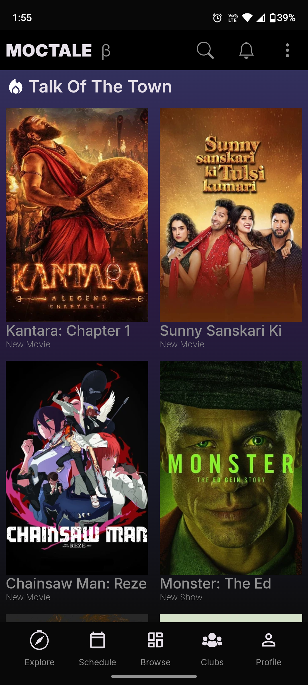
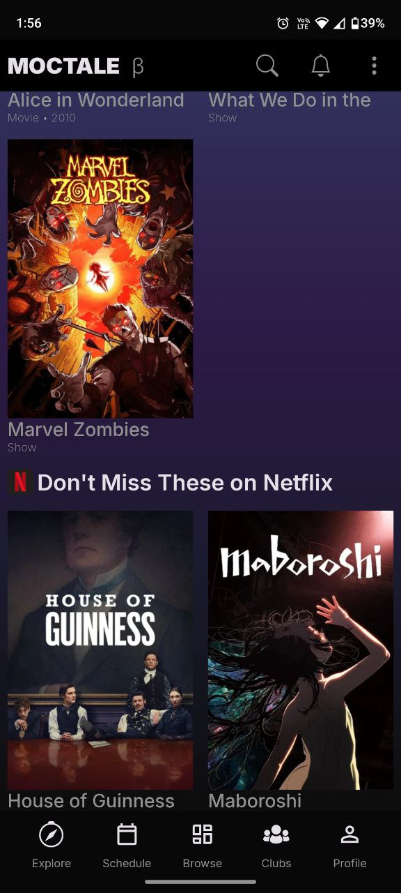
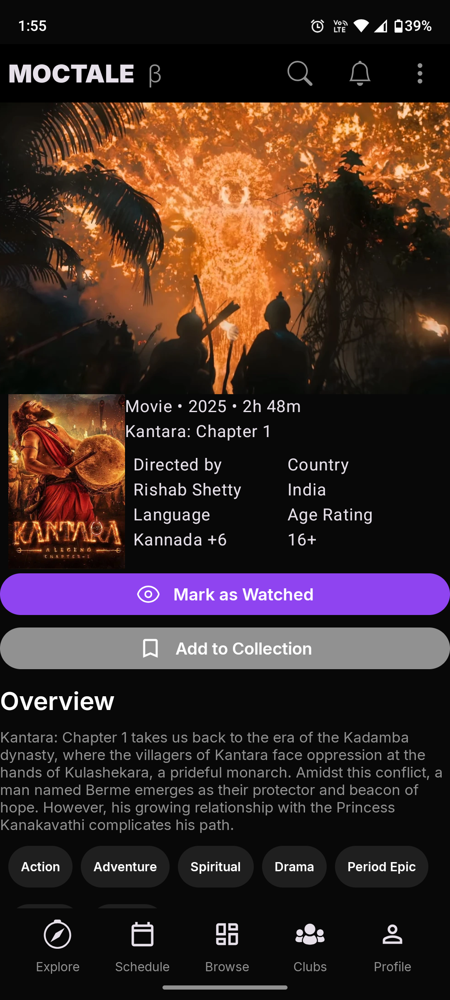
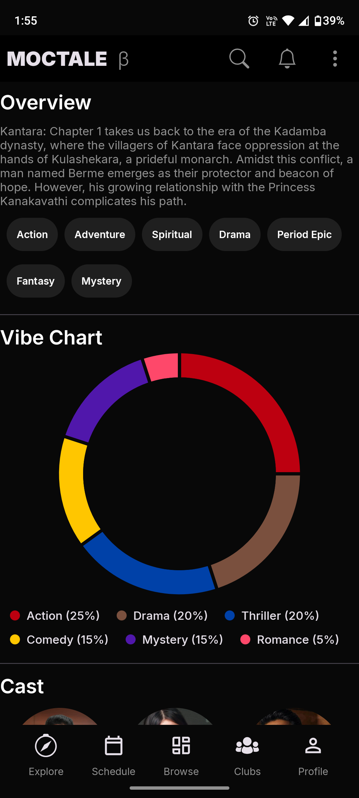
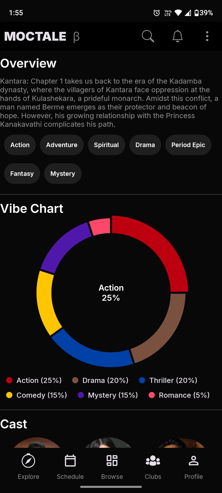
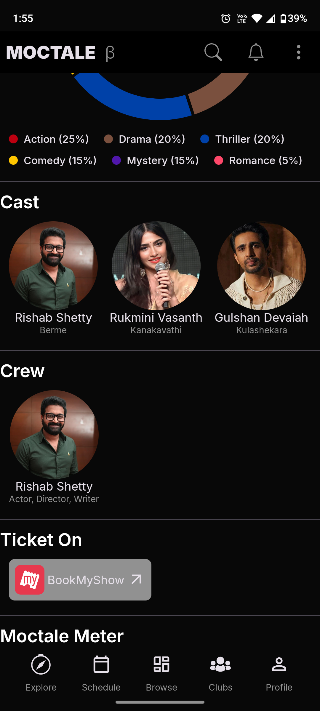
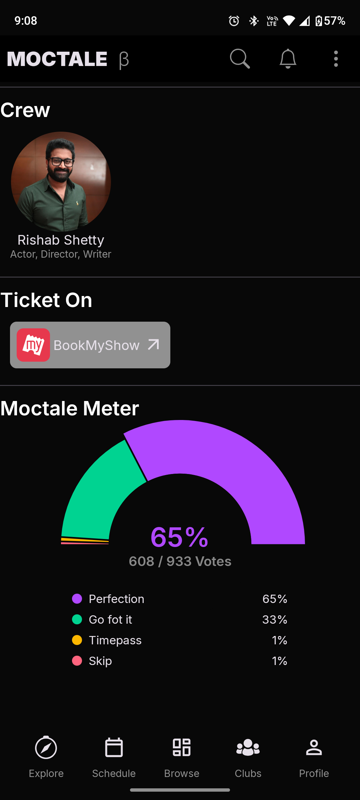

# Moctale
This project is not related to [Moctale.in](https://www.moctale.in) and all the right of contain is hold by moctale.
> [!IMPORTANT]  
> This is not the main repo. Main Repo with latest feature and many more things is private as of now. and this repo lack features so use accordingly.

---
## 📁 Project Structure 
```
app/
├── src/main/java/com/example/app 
│   ├── data/                # Data sources, repositories
│   ├── di/                  # Dependency injection modules
│   ├── domain/              # model and usecase
│   ├── presentation/        # Screen and navigation
│   └──  ui/
│     └── theme/             # App theme, colors, typography
└── src/main/res/
  ├── drawable/              # images & vectro svg
  ├── font/                  # custom font (Inter)
  └── values/
 
assets/                      # Demo images
```

---

## Getting Started

### Prerequisites

- Android Studio Flamingo / Electric Eel or newer  
- JDK 21  
- Git  
- Android SDK (API 31+)  

### Clone the Project

```bash
git clone git@github.com:manishjajoriya/Moctale.git
cd Moctale
````

### Open in Android Studio

1. Open Android Studio → **Open** → Navigate to project root
2. Let Gradle sync automatically
3. Install any missing SDK components if prompted

---

## Building and Running

### Using Android Studio

1. Select a **target device** (emulator or physical device)
2. Click the green **Run** ▶️ button
3. App will build and launch

### Using Command Line (Gradle)
- Create `local.properties` in moctale directory which point to you android sdk path, ex -
```
sdk.dir=C\:\\Users\\<YourUsername>\\AppData\\Local\\Android\\Sdk`
```

```bash
# For debug APK
gradlew clean assembleDebug
```

### Directory of Build Outputs

* APK: `app/build/outputs/apk/debug/app-debug.apk`
---
## Images
| Image 1                                                        | Image 2                                                        | Image 4                                                        |
|----------------------------------------------------------------|----------------------------------------------------------------|----------------------------------------------------------------|
|  |  |  |

| Image 3                                                        | Image 5                                                        | Image 6                                                        |
|----------------------------------------------------------------|----------------------------------------------------------------|----------------------------------------------------------------|
|  |  |  |

| Image 7                                                        |
|----------------------------------------------------------------|
|  |


